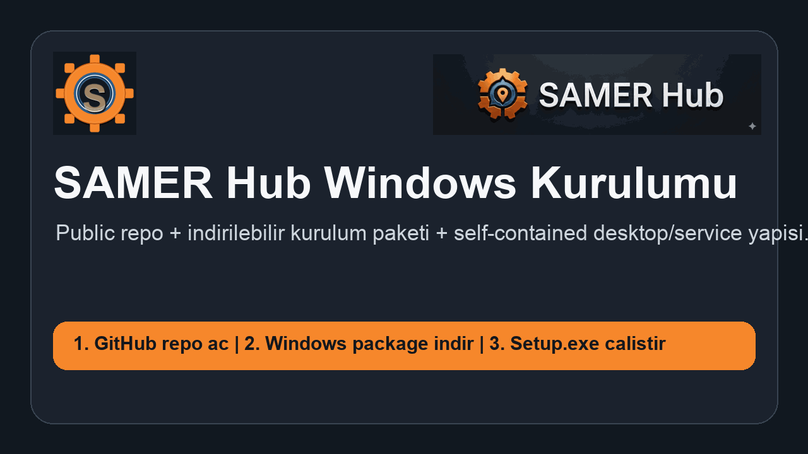
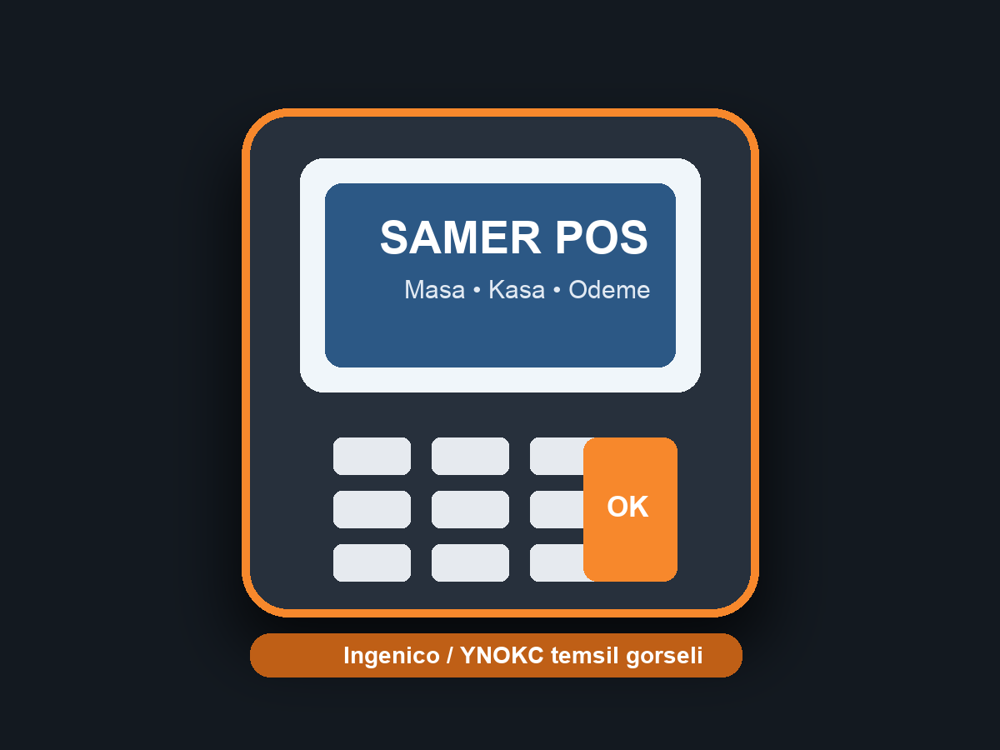

# SAMER Hub

Windows odakli restoran operasyon paketi: masa yonetimi, kasa, paket siparis akisi, POS baglantilari ve servis + desktop mimarisi tek projede birlesir.


## Ozet

- `SamerHub.Service`: yerel backend servisi
- `SamerHub.Desktop.Avalonia`: Windows masaustu uygulamasi
- `installer/Setup`: Windows kurulum uygulamasi
- `publish.sh`: self-contained Windows ciktilarini uretir
- `package-windows.sh`: GitHub Release veya paylasim icin indirilebilir Windows paketi hazirlar

## Hemen Bak



## POS Temsili



Bu gorsel repo icindeki POS entegrasyon hikayesini temsil eder. Gercek terminal akisi servis tarafinda ayar repository'leri ve POS gateway katmani ile yonetilir.

## Windows Build

macOS veya Linux uzerinden Windows ciktilari uretmek icin:

```bash
chmod +x publish.sh package-windows.sh
./publish.sh
./package-windows.sh
```

Olusan dosyalar:

- `publish/service/SamerHub.Service.exe`
- `publish/desktop/SamerHub.Desktop.Avalonia.exe`
- `publish/setup/Setup.exe`
- `dist/SAMERHub-Windows-Package.zip`

## Windows Kurulum

Windows makinede iki secenek var:

1. `dist/SAMERHub-Windows-Package.zip` dosyasini indir ve ac.
2. Arsiv icindeki `setup/Setup.exe` dosyasini yonetici olarak calistir.

Kurulum sirasinda:

- servis dosyalari kopyalanir
- desktop uygulamasi kurulur
- yerel SQLite veritabani hazirlanir
- masaustu kisayolu eklenir

## Repo Yayin Akisi

Public GitHub repo icin onerilen akıs:

1. Kaynak kodu bu repo olarak push et.
2. `dist/SAMERHub-Windows-Package.zip` dosyasini bir GitHub Release'e ekle.
3. Windows PC tarafinda source kod degil, release paketini indir.

Bu yontem repo'yu temiz tutar ve kullanicinin tek zip ile kurulum yapmasini saglar.
